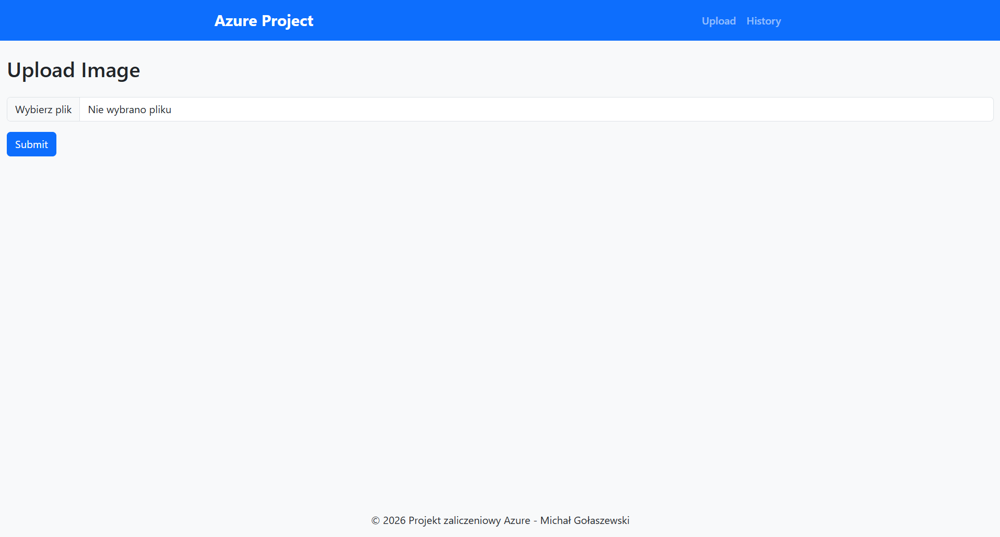
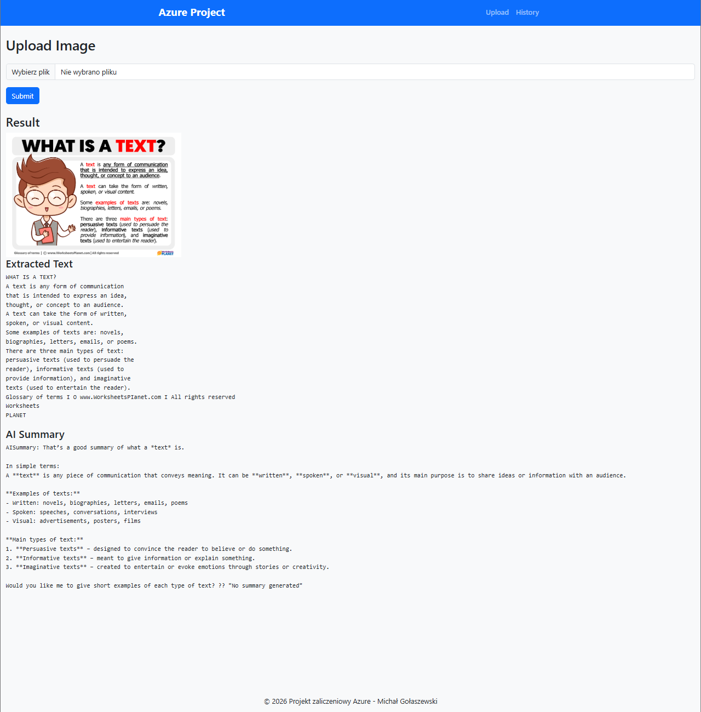
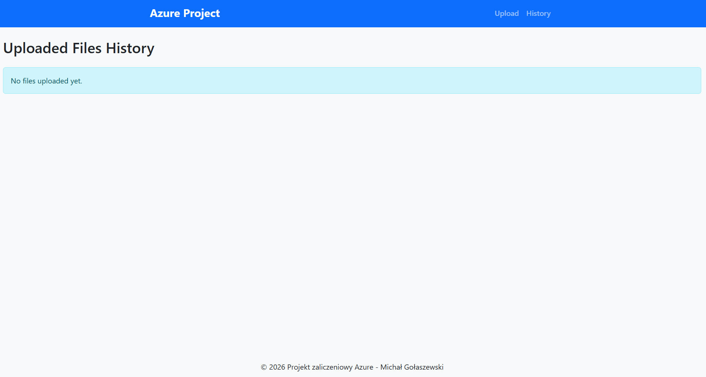
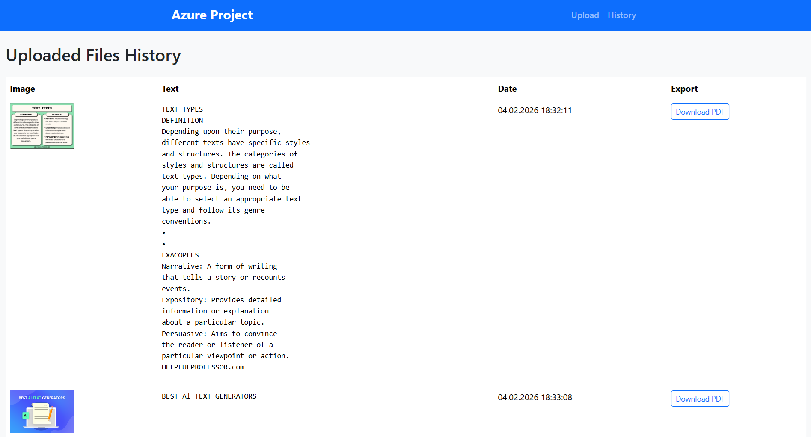

# Azure OCR & AI Summary Web Application

## 📌 Opis projektu
Aplikacja webowa stworzona w **ASP.NET MVC**, która umożliwia:
- upload obrazu,
- ekstrakcję tekstu z obrazu (OCR),
- generowanie podsumowania tekstu przy użyciu AI,
- zapis danych w bazie NoSQL,
- eksport wyników do pliku PDF.

Projekt wykorzystuje nowoczesne usługi **Microsoft Azure** i został wykonany jako projekt zaliczeniowy.

---

## 🚀 Funkcjonalności
- 📤 Upload obrazu (PNG/JPG)
- 👁️ OCR – rozpoznawanie tekstu z obrazu (Azure Computer Vision)
- 🤖 AI Summary – generowanie podsumowania tekstu (Azure OpenAI / Foundry)
- ☁️ Przechowywanie obrazów w Azure Blob Storage
- 🗄️ Przechowywanie danych w Azure Cosmos DB (NoSQL)
- 📄 Generowanie pliku PDF z:
  - nazwą pliku,
  - datą uploadu,
  - obrazem,
  - rozpoznanym tekstem,
  - stopką projektu
- 📜 Historia przesłanych plików

---

## 🚀 Funkcjonalności
- 📤 Upload obrazu (PNG/JPG)
- 👁️ OCR – rozpoznawanie tekstu z obrazu (Azure Computer Vision)
- 🤖 AI Summary – generowanie podsumowania tekstu (Azure OpenAI / Foundry)
- ☁️ Przechowywanie obrazów w Azure Blob Storage
- 🗄️ Przechowywanie danych w Azure Cosmos DB (NoSQL)
- 📄 Generowanie pliku PDF z:
  - nazwą pliku,
  - datą uploadu,
  - obrazem,
  - rozpoznanym tekstem,
  - stopką projektu
- 📜 Historia przesłanych plików

---

## 🖼️ Zrzuty ekranu

### Strona startowa


### Upload obrazu


### Czysta historia


### Historia


---

## ⚙️ Konfiguracja projektu

### 1️⃣ appsettings.json
Uzupełnij plik `appsettings.json` własnymi danymi:

```json
{
  "CosmosDb": {
    "Endpoint": "YOUR_COSMOS_ENDPOINT",
    "Key": "YOUR_COSMOS_KEY",
    "DatabaseName": "YOUR_DATABASE_NAME",
    "ContainerName": "YOUR_CONTAINER_NAME"
  },
  "AzureVision": {
    "Endpoint": "YOUR_COMPUTER_VISION_ENDPOINT",
    "Key": "YOUR_COMPUTER_VISION_KEY"
  },
  "AzureOpenAI": {
    "Endpoint": "YOUR_OPENAI_ENDPOINT",
    "Key": "YOUR_OPENAI_KEY",
    "DeploymentName": "gpt-5-chat"
  },
  "BlobStorage": {
    "ConnectionString": "YOUR_STORAGE_CONNECTION_STRING",
    "ContainerName": "images"
  }
}
```
⚠️ Klucze i dane dostępowe nie są przechowywane w repozytorium.

---

## 📁 Struktura projektu
```
Project/
│
├── Controllers/
│   └── VisionController.cs
│
├── Services/
│   ├── CosmosDbService.cs
│   ├── PdfGeneratorService.cs
│   └── AIService.cs
│
├── Models/
│   └── ImageDocument.cs
│
├── Views/
│   └── Vision/
│       ├── Upload.cshtml
│       ├── History.cshtml
│
└── wwwroot/
    └── css/
        └── site.css
```

---

## 🎓 Cel projektu

Projekt został wykonany w celach edukacyjnych jako:

- demonstracja integracji ASP.NET MVC z usługami Azure,

- praktyczne użycie AI w aplikacji webowej,

- przykład architektury chmurowej w projekcie .NET.

---

## 👤 Autor

Michał Gołaszewski
Projekt zaliczeniowy – ASP.NET MVC & Microsoft Azure
2026

---

## 📜 Licencja
Ten projekt jest udostępniony na licencji **MIT**.  
Możesz swobodnie używać, modyfikować i rozpowszechniać kod, z zachowaniem informacji o autorze.
